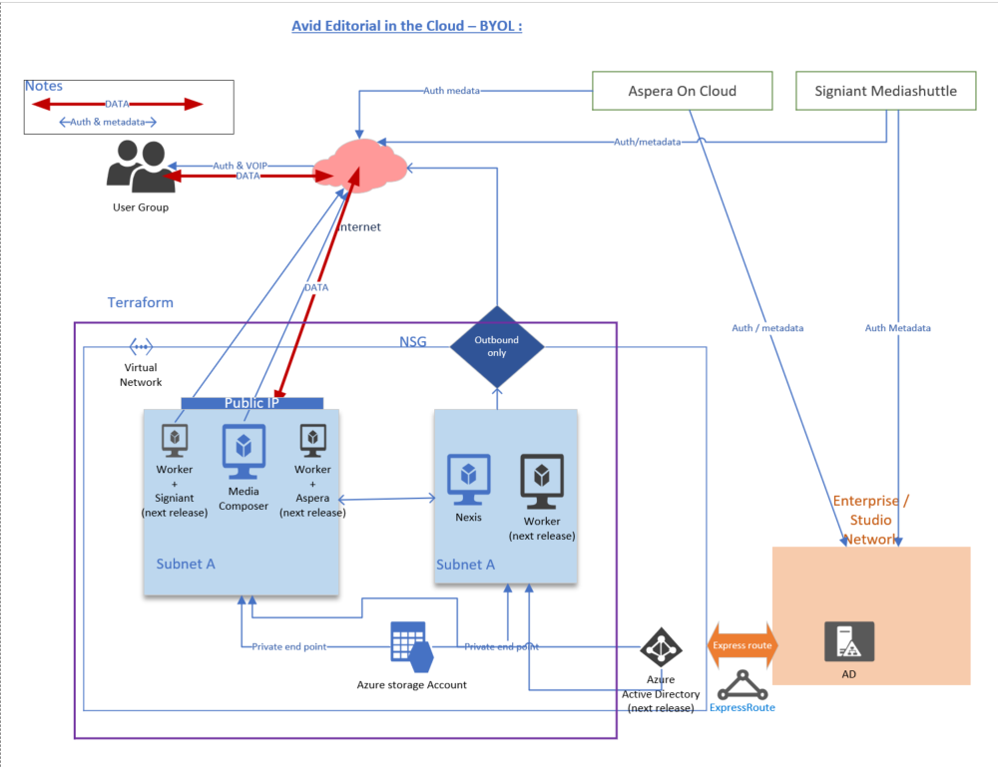

# EitC - BYOL (Editorial In The Cloud)

Terraform templates used to deploy the following 

-Media Composer ( GPU ) with Teradici  
-Nexis (Online or Nearline)  
-Jumphost ( to access Nexis)  
in any azure subscription.  

Note : 
* Make sure you have the right GPU SKU is available in the region  

## Requirement : 

-Terraform  
-Azure subscription   
-Avid Licenses (Nexis, Media composer)  
-Teradici licenses   

## Arch

## Basic installation 

#### Setup 
1. [Install az cli](https://docs.microsoft.com/en-us/cli/azure/install-azure-cli?view=azure-cli-latest)    
2. [Install Terraform](https://www.terraform.io/downloads.html)  
3. copy EITC-BYOL to a local directory   
4. login to Azure using az login command line   
5. Edit  EITC-BYOL/main.tf with custom information   
(note : Make sure you lock down source IP address / subnet)   
6. execute terraform init  
7. execute terrafrom plan   
8. run terrafrom apply   

## Backlog / Next Versions :
Option to apply Avid License during installation   
Setup connecting to existing Vnet / subnet  
Adding firewall rules & seperating subnets (based on security standards)  
Integrating with Azure AD for authenticatio
